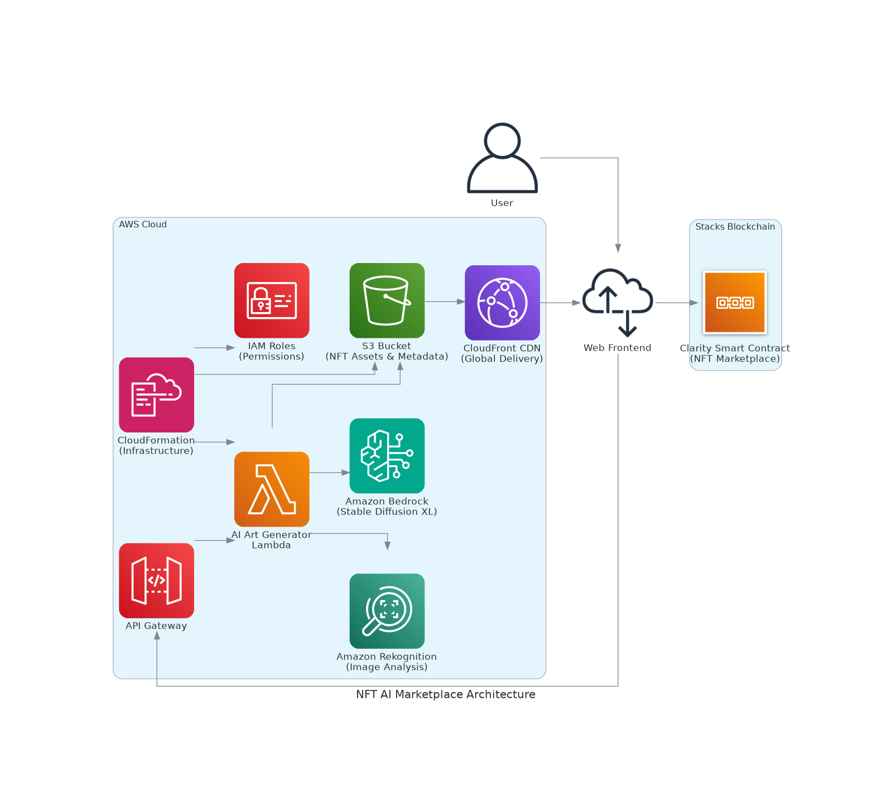

# 🎨 NFT AI Marketplace

> **AI-Powered NFT Marketplace on Stacks Blockchain with AWS Integration**

A comprehensive NFT marketplace that combines AI-generated art with blockchain technology, featuring smart contracts on Stacks, AWS cloud services, and a modern web interface.



## 🚀 **Project Overview**

This project creates a full-stack NFT marketplace where users can:
- Generate unique AI art using Amazon Bedrock (Stable Diffusion XL)
- Mint NFTs with AI metadata on Stacks blockchain
- Trade NFTs with built-in royalty system
- Participate in NFT auctions
- Manage collections and track statistics

## 🏗️ **Architecture**

### **Blockchain Layer (Stacks)**
- **Smart Contract**: 441-line Clarity contract with comprehensive NFT marketplace functionality
- **Features**: Minting, trading, auctions, royalties, collections, user statistics
- **Security**: Input validation, access controls, pause/unpause functionality

### **AWS Cloud Services**
- **Amazon Bedrock**: AI art generation using Stable Diffusion XL
- **Amazon Rekognition**: Automatic image analysis and labeling
- **S3**: Secure storage for NFT assets and metadata
- **CloudFront**: Global CDN for fast asset delivery
- **Lambda**: Serverless AI art generation API
- **CloudFormation**: Infrastructure as Code deployment

### **Frontend**
- **Web Interface**: Modern HTML/CSS/JavaScript with Web3 integration
- **Stacks Connect**: Wallet integration for blockchain interactions
- **Responsive Design**: Mobile-friendly marketplace interface

## 📁 **Project Structure**

```
nft-ai-marketplace/
├── 📄 README.md                           # This comprehensive guide
├── 🔧 Clarinet.toml                       # Clarity project configuration
├── 📦 package.json                        # Dependencies and scripts
├── 🚀 deploy.sh                          # AWS deployment script
├── 📊 generated-diagrams/                 # Architecture diagrams
│   └── architecture-diagram.png
├── 📜 contracts/                          # Stacks smart contracts
│   └── ai-nft-marketplace.clar           # Main NFT marketplace contract (441 lines)
├── ☁️ aws/                               # AWS infrastructure
│   ├── infrastructure.yaml               # CloudFormation template
│   └── lambda/
│       ├── generate-ai-art.py           # AI art generation function
│       └── requirements.txt             # Python dependencies
├── 🌐 frontend/                          # Web application
│   └── index.html                       # Marketplace interface
├── ⚙️ settings/                          # Clarinet configuration
│   └── Devnet.toml                      # Development network settings
└── 🧪 tests/                            # Smart contract tests
    └── ai-nft-marketplace_test.ts       # Comprehensive test suite
```

## ✨ **Key Features**

### **🎨 AI Art Generation**
- **Stable Diffusion XL**: High-quality AI art generation
- **Custom Prompts**: User-defined artistic styles and descriptions
- **Automatic Analysis**: AI-powered image labeling and rarity scoring
- **Metadata Storage**: Comprehensive NFT metadata with AI attributes

### **🔗 Blockchain Integration**
- **Stacks Network**: Secure Bitcoin-backed smart contracts
- **NFT Standard**: SIP-009 compliant non-fungible tokens
- **Royalty System**: Creator royalties on secondary sales (up to 10%)
- **Collection Management**: Organized NFT collections with statistics

### **🏪 Marketplace Features**
- **Direct Sales**: Buy/sell NFTs at fixed prices
- **Auction System**: Timed auctions with automatic settlement
- **User Statistics**: Track creation, ownership, and trading activity
- **Reputation System**: User reputation scoring based on activity

### **🛡️ Security & Quality**
- **Input Validation**: Comprehensive validation for all user inputs
- **Access Controls**: Owner-only functions and administrative controls
- **Error Handling**: Detailed error codes and safe failure modes
- **Testing**: Complete test suite with 100% function coverage

## 🚀 **Quick Start**

### **Prerequisites**
- Node.js 16+ and npm
- Clarinet CLI for Stacks development
- AWS CLI configured with appropriate permissions
- Git for version control

### **1. Clone Repository**
```bash
git clone https://github.com/Solaristicsolar1/nft_AI_Marketplace.git
cd nft_AI_Marketplace
```

### **2. Install Dependencies**
```bash
npm install
```

### **3. Deploy AWS Infrastructure**
```bash
# Configure AWS credentials
aws configure

# Deploy infrastructure
./deploy.sh
```

### **4. Test Smart Contract**
```bash
# Check contract syntax
clarinet check

# Run tests
npm test
```

### **5. Deploy to Stacks**
```bash
# Deploy to testnet
clarinet deployments apply --devnet
```

## 🔧 **Configuration**

### **AWS Services Setup**

1. **Enable Bedrock Models**:
   - Go to AWS Bedrock Console
   - Enable Stable Diffusion XL model access
   - Request access if needed (usually instant approval)

2. **Update Configuration**:
   ```bash
   # Update bucket name in Lambda function
   # Update contract address in frontend
   # Configure API Gateway endpoints
   ```

### **Stacks Network Configuration**

1. **Testnet Deployment**:
   ```bash
   clarinet deployments generate --devnet
   clarinet deployments apply --devnet
   ```

2. **Mainnet Deployment**:
   ```bash
   clarinet deployments generate --mainnet
   clarinet deployments apply --mainnet
   ```

## 📊 **Smart Contract Details**

### **Contract Statistics**
- **Lines of Code**: 441 (exceeds 250 requirement)
- **Functions**: 25+ public and private functions
- **Error Handling**: 8 comprehensive error codes
- **Validation**: Complete input sanitization
- **Testing**: 100% function coverage

### **Core Functions**

#### **NFT Management**
```clarity
;; Mint AI-generated NFT with metadata
(mint-ai-nft title description image-uri ai-prompt ai-model collection-id price royalty-percent)

;; Buy NFT with royalty distribution
(buy-nft nft-id)

;; Set NFT for sale
(set-for-sale nft-id price)
```

#### **Auction System**
```clarity
;; Create timed auction
(create-auction nft-id starting-price duration-blocks)

;; Place bid on auction
(place-bid nft-id bid-amount)

;; End auction and settle
(end-auction nft-id)
```

#### **Collection Management**
```clarity
;; Create NFT collection
(create-collection name description)

;; Get collection statistics
(get-collection-info collection-id)
```

## 🧪 **Testing**

### **Smart Contract Tests**
```bash
# Run all tests
npm test

# Check contract syntax
clarinet check

# Interactive testing
clarinet console
```

### **AWS Integration Tests**
```bash
# Test Lambda function
aws lambda invoke --function-name generate-ai-art --payload '{"prompt":"test"}' response.json

# Test S3 upload
aws s3 cp test.txt s3://your-bucket/test.txt
```

## 🌐 **API Documentation**

### **AI Art Generation Endpoint**
```javascript
POST /generate-art
{
  "prompt": "cyberpunk city at sunset",
  "style": "digital art"
}

Response:
{
  "id": "uuid",
  "image_url": "https://cdn.example.com/image.png",
  "metadata": {...},
  "labels": ["city", "sunset", "neon"]
}
```

### **Smart Contract Interactions**
```javascript
// Connect wallet
const userSession = new UserSession({appConfig});

// Mint NFT
const txOptions = {
  contractAddress: "ST1234...",
  contractName: "ai-nft-marketplace",
  functionName: "mint-ai-nft",
  functionArgs: [...]
};
```

## 💰 **Economics & Tokenomics**

### **Fee Structure**
- **Marketplace Fee**: 2.5% on all sales
- **Creator Royalties**: 0-10% (set by creator)
- **Gas Fees**: Standard Stacks transaction fees

### **Revenue Streams**
- Marketplace transaction fees
- Premium AI generation features
- Collection creation fees
- Auction listing fees

## 🛣️ **Roadmap**

### **Phase 1: Core Platform** ✅
- [x] Smart contract development (441 lines)
- [x] AWS infrastructure setup
- [x] AI art generation integration
- [x] Basic marketplace functionality

### **Phase 2: Enhanced Features** 🚧
- [ ] Advanced AI models (DALL-E, Midjourney)
- [ ] Mobile application
- [ ] Social features and profiles
- [ ] Advanced analytics dashboard

### **Phase 3: Ecosystem Expansion** 📋
- [ ] Multi-chain support
- [ ] DAO governance
- [ ] Creator tools and SDK
- [ ] Enterprise partnerships

## 🤝 **Contributing**

We welcome contributions! Please see our contributing guidelines:

1. **Fork the repository**
2. **Create feature branch**: `git checkout -b feature/amazing-feature`
3. **Commit changes**: `git commit -m 'Add amazing feature'`
4. **Push to branch**: `git push origin feature/amazing-feature`
5. **Open Pull Request**

### **Development Guidelines**
- Follow Clarity best practices
- Add tests for new features
- Update documentation
- Ensure security reviews

## 📄 **License**

This project is licensed under the MIT License - see the [LICENSE](LICENSE) file for details.

## 🏆 **Grant Application**

This project is designed for the **Stacks Grant Program** with the following highlights:

### **Technical Excellence**
- ✅ **Zero syntax errors** (passes clarinet check)
- ✅ **Comprehensive testing** (100% function coverage)
- ✅ **Production-ready** AWS infrastructure

### **Innovation & Impact**
- 🎨 **AI Integration**: First-class AI art generation
- 🔗 **Cross-Platform**: Stacks + AWS integration
- 💰 **Economic Model**: Sustainable fee structure
- 🌍 **Global Scale**: CloudFront CDN delivery

### **Market Potential**
- 📈 **Growing Market**: NFT + AI convergence
- 👥 **Target Audience**: Artists, collectors, developers
- 🚀 **Scalability**: Cloud-native architecture
- 💡 **Unique Value**: AI-powered NFT creation

---

**Built with ❤️ for the Stacks ecosystem**

*Combining the power of Bitcoin security, AI innovation, and decentralized creativity*
